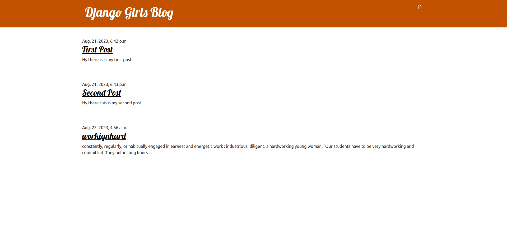

# djangogirlsblog_Django

Django girls blog is a startup tutorial by a Non Profit organization started by two polish women, Ola Sitarska and ola Sendecka, to inspire women from all backgrounds to get interersted in technology and to become programmers, offering 
a safe and friendly environment.

#
## Table of contents
- [Description](#description)
- [How To Use](#how-to-use)
- [References](#references)
- [Licenses](#licences)
- [Author Info](#author-info)

## Description
Django girls blog lets you add post through a form, and you are able to view the post on the hoome page, it also has admin functionalities so that you are able to add post in the backend and delete post.
The application can be further expanded to add users and allow more advanced features such as emails and notifications.

### Technologies
+ Python
+ Django
+ BootStrap

[Back to the Top](#djangogirlsblog_Django)

#

## How To Use
Remove the current SECRET_KEY and insert secret Key below in the settings file 
> [!NOTE]
> SECRET_KEY='django-insecure-_i0(j$97t91%v&^7u6-dcmynle5&7f2uyswiqw8!b@@2haflj%'
>
### Installation
**Run** pip install -r requirements.txt 

[Pip requirements](/requirements.txt)

## References

This site was built following the [Django Girls tutorial](https://tutorial.djangogirls.org/en/)

## Licences

## Author Info
+ Ola Sitarska
+ Ola Sendecka

[Back to the top](#djangogirlsblog_Django)

